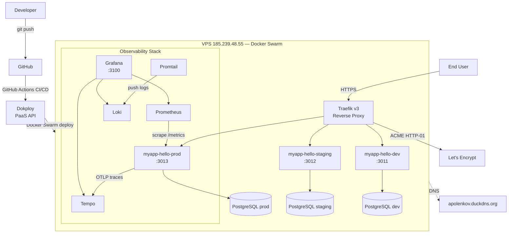

# myapp-hello

[](https://github.com/apolenkov/myapp-hello/actions)
[](https://codecov.io/gh/apolenkov/myapp-hello)
[](https://nodejs.org/)
[](LICENSE)

A production-ready Node.js REST API built with NestJS and PostgreSQL. Ships with structured logging,
OpenTelemetry instrumentation, JWT authentication guard, rate limiting, OpenAPI documentation,
automated database migrations, a full CI/CD pipeline, and a complete observability stack (Grafana +
Prometheus + Loki + Tempo) — all deploying to three isolated environments on a Docker Swarm VPS via
Dokploy.

## Architecture

<!-- prettier-ignore -->


## Quick Start

**Prerequisites:** Docker and Docker Compose installed locally.

```bash
git clone https://github.com/apolenkov/myapp-hello.git
cd myapp-hello
docker compose up --build
```

The API is available at `http://localhost:3001`.

For local development without Docker:

```bash
npm install
cp .env.example .env   # fill in DATABASE_URL
npm run dev
```

## Environment Variables

| Variable       | Required | Default       | Description                                  |
| -------------- | -------- | ------------- | -------------------------------------------- |
| `PORT`         | No       | `3001`        | HTTP port the app listens on                 |
| `NODE_ENV`     | No       | `development` | Runtime environment label                    |
| `APP_NAME`     | No       | `myapp-hello` | Application name included in responses       |
| `DATABASE_URL` | No       | —             | PostgreSQL connection string                 |
| `JWT_SECRET`   | No       | —             | Secret key for JWT verification              |
| `LOG_LEVEL`    | No       | `info`        | Pino log level (trace/debug/info/warn/error) |

When `DATABASE_URL` is not set the app runs without a database and reports `db: "not configured"`.

## API Endpoints

| Method | Path            | Auth | Description                           |
| ------ | --------------- | ---- | ------------------------------------- |
| GET    | `/v1`           | None | Hello World response with DB status   |
| GET    | `/health`       | None | Health check — returns `status: "ok"` |
| GET    | `/metrics`      | None | Prometheus metrics (internal only)    |
| GET    | `/docs`         | None | Swagger UI (OpenAPI 3.0)              |
| GET    | `/openapi.json` | None | Raw OpenAPI specification             |

Protected routes are secured by a global `JwtAuthGuard`. Use the `@Public()` decorator to opt out
specific endpoints from authentication.

## Environments

| Environment | Branch | External Port | URL                                     |
| ----------- | ------ | ------------- | --------------------------------------- |
| Production  | `main` | `:3013`       | `https://apolenkov.duckdns.org`         |
| Staging     | `main` | `:3012`       | `https://staging.apolenkov.duckdns.org` |
| Dev         | `main` | `:3011`       | `https://dev.apolenkov.duckdns.org`     |

All three environments deploy from `main` via artifact promotion — the same Docker image (tagged
with the commit SHA) is promoted through dev → staging → production. Each environment has its own
PostgreSQL instance and independent configuration.

## Documentation

- [Architecture](docs/architecture.md) — C4 diagrams (Context, Container, Component, Deployment)
- [Deployment](docs/deployment.md) — CI/CD pipeline, environments, rollback, secrets
- [Development](docs/development.md) — Local setup, npm scripts, DB migrations, testing
- [API Reference](docs/api.md) — Endpoints, authentication, rate limiting
- [Observability](docs/observability.md) — Monitoring stack, dashboards, alerts, adding new services

## Tech Stack

| Layer             | Technology                                           |
| ----------------- | ---------------------------------------------------- |
| Runtime           | Node.js 22 (LTS)                                     |
| Framework         | NestJS 11 (Express adapter)                          |
| Language          | TypeScript 5 (strict mode)                           |
| Database          | PostgreSQL 18 via `node-postgres`                    |
| Logging           | nestjs-pino (structured JSON via Pino)               |
| Observability     | OpenTelemetry + Prometheus + Loki + Tempo + Grafana  |
| Auth              | @nestjs/jwt + global JwtAuthGuard                    |
| Rate limiting     | @nestjs/throttler (global ThrottlerGuard)            |
| API docs          | @nestjs/swagger (decorator-driven OpenAPI)           |
| Testing           | Vitest + @vitest/coverage-v8                         |
| Linting           | ESLint 9 (sonarjs, unicorn, security, import-x)      |
| Formatting        | Prettier 3                                           |
| Architecture lint | dependency-cruiser                                   |
| Containerization  | Docker (multi-stage build, non-root user, dumb-init) |
| Orchestration     | Docker Swarm via Dokploy                             |
| CI/CD             | GitHub Actions                                       |
| Releases          | semantic-release                                     |
