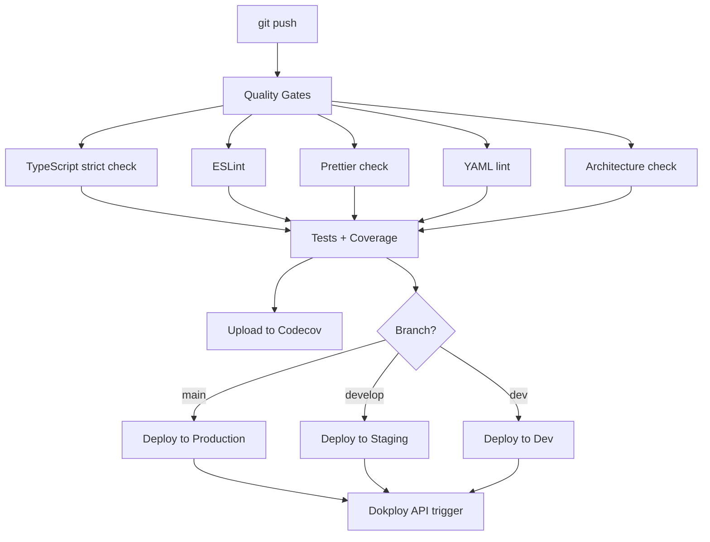

# Deployment Guide

This document covers the CI/CD pipeline, environment configuration, manual deployments, rollback
procedures, SSL certificate management, and GitHub Secrets setup.

## CI/CD Pipeline

Every push to `main`, `develop`, or `dev` triggers the GitHub Actions workflow defined in
`.github/workflows/ci-cd.yml`. The pipeline runs quality gates and tests in parallel before
deploying.

<!-- prettier-ignore -->


### Pipeline Steps

| Step                    | Tool                 | Failure behavior                         |
| ----------------------- | -------------------- | ---------------------------------------- |
| TypeScript strict check | `tsc --noEmit`       | Blocks deploy                            |
| ESLint                  | `eslint src`         | Blocks deploy                            |
| Prettier check          | `prettier --check .` | Blocks deploy                            |
| YAML lint               | `yamllint .github/`  | Blocks deploy                            |
| Architecture check      | `depcruise`          | Blocks deploy                            |
| Tests                   | `vitest run`         | Blocks deploy                            |
| Coverage upload         | `codecov-action@v5`  | Non-blocking (`fail_ci_if_error: false`) |
| Deploy                  | Dokploy REST API     | Blocks on API error                      |

## Environments

| Environment | Branch    | External Port | Internal Port | URL                                     |
| ----------- | --------- | ------------- | ------------- | --------------------------------------- |
| Production  | `main`    | `:3013`       | `:3001`       | `https://apolenkov.duckdns.org`         |
| Staging     | `develop` | `:3012`       | `:3001`       | `https://staging.apolenkov.duckdns.org` |
| Dev         | `dev`     | `:3011`       | `:3001`       | `https://dev.apolenkov.duckdns.org`     |

Each environment maps to a separate Dokploy service and a separate PostgreSQL container with its
own persistent volume.

## Deploy via Git Push

The standard deployment workflow:

```bash
# Deploy to production
git checkout main
git merge develop
git push origin main

# Deploy to staging
git checkout develop
git push origin develop

# Deploy to dev environment
git checkout dev
git push origin dev
```

The pipeline runs automatically. Monitor progress in the GitHub Actions tab of the repository.

## Manual Deploy via gh CLI

To trigger a deploy without pushing new commits:

```bash
# Re-run the last workflow run on a branch
gh run list --workflow=ci-cd.yml --branch=main --limit=1
gh run rerun <run-id>
```

To trigger the Dokploy API directly (bypassing CI):

```bash
curl -sf -X POST \
  "$DOKPLOY_URL/api/trpc/application.deploy" \
  -H "x-api-key: $DOKPLOY_TOKEN" \
  -H "Content-Type: application/json" \
  -d "{\"json\":{\"applicationId\":\"$SERVICE_ID\"}}"
```

## Rollback

### Via Dokploy UI

1. Open the Dokploy admin panel at `http://185.239.48.55:3000`
2. Select the target service (e.g., `myapp-hello-prod`)
3. Navigate to **Deployments** tab
4. Click **Redeploy** on a previous successful deployment

### Via Git Revert

```bash
# Find the last good commit
git log --oneline main

# Revert the bad commit (creates a new revert commit)
git revert <bad-commit-sha>
git push origin main
```

Never force-push to `main`. The revert commit triggers a new pipeline run that deploys the reverted
state.

### Database Rollback

Database migrations are applied forward-only. If a migration needs to be undone:

1. Write a new migration file in `migrations/` that reverses the change (e.g.,
   `002_revert_initial.sql`)
2. Push to the appropriate branch — it will be applied automatically on next startup

## SSL Certificate Renewal

TLS certificates are issued by Let's Encrypt via Traefik's built-in ACME HTTP-01 challenge. No
manual renewal is required.

Traefik stores certificates in a volume and renews them automatically 30 days before expiry. To
verify certificate status:

```bash
# Check certificate expiry for the production domain
echo | openssl s_client -connect apolenkov.duckdns.org:443 -servername apolenkov.duckdns.org \
  2>/dev/null | openssl x509 -noout -dates
```

If automatic renewal fails, force renewal by restarting the Traefik service on the VPS:

```bash
docker service update --force traefik_traefik
```

## Observability Stack Deployment

The observability stack (Grafana, Prometheus, Loki, Tempo, Promtail) is deployed separately from
the application using Ansible.

### Initial Deploy

```bash
cd infra-ansible
ansible-playbook playbooks/07-observability.yml -i inventory/hosts.yml --ask-vault-pass
```

This copies all configs from `observability/` to `/opt/observability` on the VPS, creates a `.env`
file with Grafana credentials from the Ansible vault, and starts all 5 services via Docker Compose.

### Full Stack Deploy (Including Observability)

```bash
ansible-playbook playbooks/site.yml -i inventory/hosts.yml --ask-vault-pass
```

### Updating Configs

After modifying any file in `observability/`, redeploy the stack:

```bash
ansible-playbook playbooks/07-observability.yml -i inventory/hosts.yml --ask-vault-pass
```

The playbook uses `synchronize` with `delete: true`, so removed files on the local side will also
be removed on the VPS. Grafana, Prometheus, and Loki will pick up config changes on restart.

### Post-Deploy Verification

The CI/CD pipeline includes two non-blocking post-deploy steps:

1. **Verify /metrics endpoint** — checks that the application exposes Prometheus metrics
2. **Create Grafana deploy annotation** — marks the deploy time on Grafana dashboards for
   correlation with metrics/logs changes

Both steps use `continue-on-error: true` and do not block the pipeline.

### Ansible Vault Variables

| Variable                 | Description                                           |
| ------------------------ | ----------------------------------------------------- |
| `grafana_admin_user`     | Grafana admin username (default: `admin`)             |
| `grafana_admin_password` | Grafana admin password                                |
| `grafana_root_url`       | Grafana public URL (default: `http://localhost:3100`) |

### Access

| Service    | URL                         | Access        |
| ---------- | --------------------------- | ------------- |
| Grafana    | `http://185.239.48.55:3100` | Admin login   |
| Prometheus | `http://localhost:9090`     | Internal only |
| Loki       | `http://localhost:3100`     | Internal only |
| Tempo      | `http://localhost:3200`     | Internal only |

For details on dashboards, alerts, and adding new services, see the
[Observability Guide](observability.md).

## GitHub Secrets

The following secrets must be configured in the repository before the pipeline can deploy:

| Secret                       | Description                                              |
| ---------------------------- | -------------------------------------------------------- |
| `DOKPLOY_URL`                | Dokploy API base URL (e.g., `http://185.239.48.55:3000`) |
| `DOKPLOY_TOKEN`              | Dokploy API key — generate in Dokploy Settings           |
| `DOKPLOY_SERVICE_ID_PROD`    | Dokploy application ID for the production service        |
| `DOKPLOY_SERVICE_ID_STAGING` | Dokploy application ID for the staging service           |
| `DOKPLOY_SERVICE_ID_DEV`     | Dokploy application ID for the dev service               |
| `CODECOV_TOKEN`              | Codecov upload token — obtain from codecov.io            |
| `GRAFANA_API_TOKEN`          | Grafana API token for deploy annotations (optional)      |
| `GRAFANA_URL`                | Grafana base URL for deploy annotations (optional)       |
| `APP_PUBLIC_URL`             | Public app URL for post-deploy /metrics check (optional) |

Set secrets via the GitHub web UI (**Settings > Secrets and variables > Actions**) or with the
`gh` CLI:

```bash
gh secret set DOKPLOY_URL --body "http://185.239.48.55:3000"
gh secret set DOKPLOY_TOKEN --body "<your-api-key>"
gh secret set DOKPLOY_SERVICE_ID_PROD --body "<service-id>"
gh secret set DOKPLOY_SERVICE_ID_STAGING --body "<service-id>"
gh secret set DOKPLOY_SERVICE_ID_DEV --body "<service-id>"
gh secret set CODECOV_TOKEN --body "<codecov-token>"
```

## See Also

- [Architecture](architecture.md) — Infrastructure diagrams
- [Observability Guide](observability.md) — Monitoring stack, dashboards, alerts
- [Development Guide](development.md) — Local setup and running tests
- [API Reference](api.md) — Endpoint documentation
