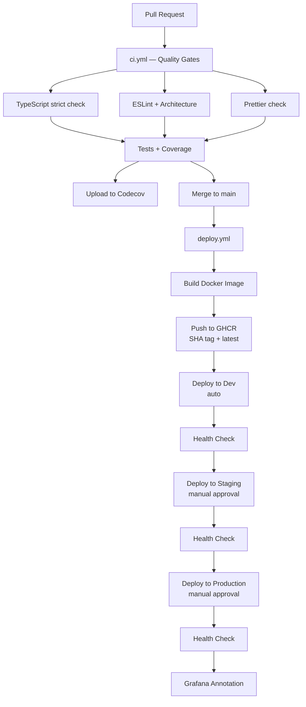

# Deployment Guide

This document covers the CI/CD pipeline, environment configuration, manual deployments, rollback
procedures, SSL certificate management, and GitHub Secrets setup.

## CI/CD Pipeline

The pipeline is split into five workflows:

- **`ci.yml`** — runs on every PR to `main` and on push to `main`. Runs quality gates and tests
- **`deploy.yml`** — runs on push to `main`. Builds a Docker image, pushes to GHCR, and deploys
  the same image through dev → staging → production (artifact promotion)
- **`db-backup.yml`** — daily PostgreSQL backups (03:00 UTC) to Yandex S3 via Dokploy API. Also
  supports manual `backup-now` and `setup-schedules` actions
- **`uptime.yml`** — health checks every 15 minutes for all 3 environments
- **`cleanup.yml`** — weekly GHCR cleanup (Sunday 02:00 UTC), deletes untagged images keeping last
  10 versions

<!-- prettier-ignore -->


### ci.yml Steps

| Step                    | Tool                   | Failure behavior                         |
| ----------------------- | ---------------------- | ---------------------------------------- |
| TypeScript strict check | `tsc --noEmit`         | Blocks merge                             |
| ESLint                  | `turbo run lint`       | Blocks merge                             |
| Prettier check          | `prettier --check .`   | Blocks merge                             |
| YAML lint               | `yamllint .github/`    | Blocks merge                             |
| Architecture check      | `turbo run check:arch` | Blocks merge                             |
| Tests                   | `turbo run test`       | Blocks merge                             |
| Coverage upload         | `codecov-action@v5`    | Non-blocking (`fail_ci_if_error: false`) |

### deploy.yml Steps

| Step                      | Tool             | Failure behavior  |
| ------------------------- | ---------------- | ----------------- |
| Build Docker image        | `docker build`   | Blocks deploy     |
| Push to GHCR              | `docker push`    | Blocks deploy     |
| Deploy to dev             | Dokploy REST API | Blocks promotion  |
| Health check (dev)        | `curl /health`   | Blocks promotion  |
| Deploy to staging         | Dokploy REST API | Requires approval |
| Health check (staging)    | `curl /health`   | Blocks promotion  |
| Deploy to production      | Dokploy REST API | Requires approval |
| Health check (production) | `curl /health`   | Blocks pipeline   |
| Verify /metrics           | `curl /metrics`  | Non-blocking      |
| Grafana annotation        | Grafana API      | Non-blocking      |

## Environments

| Environment | External Port | Internal Port | URL                                     | Approval |
| ----------- | ------------- | ------------- | --------------------------------------- | -------- |
| Production  | `:3013`       | `:3001`       | `https://apolenkov.duckdns.org`         | Manual   |
| Staging     | `:3012`       | `:3001`       | `https://staging.apolenkov.duckdns.org` | Manual   |
| Dev         | `:3011`       | `:3001`       | `https://dev.apolenkov.duckdns.org`     | Auto     |

All environments deploy from `main` via artifact promotion — the same Docker image (tagged with the
commit SHA) is promoted through dev → staging → production. Each environment maps to a separate
Dokploy service and a separate PostgreSQL container with its own persistent volume.

## Deploy via Git Push

The project uses trunk-based development — all deployments flow from a single `main` branch:

```bash
# 1. Create a feature branch
git checkout -b feat/my-feature main

# 2. Make changes, commit, push
git push origin feat/my-feature

# 3. Open a PR to main — ci.yml runs quality gates
gh pr create --base main

# 4. After merge to main — deploy.yml builds and promotes automatically
#    dev (auto) → staging (manual approval) → production (manual approval)
```

Monitor progress in the GitHub Actions tab. Staging and production deploys require manual approval
via GitHub Environments.

## Manual Deploy via gh CLI

To trigger a deploy without pushing new commits:

```bash
# Re-run the last deploy workflow
gh run list --workflow=deploy.yml --branch=main --limit=1
gh run rerun <run-id>
```

To trigger the Dokploy API directly (bypassing CI):

```bash
curl -sf -X POST \
  "$DOKPLOY_URL/api/trpc/application.deploy" \
  -H "x-api-key: $DOKPLOY_TOKEN" \
  -H "Content-Type: application/json" \
  -d "{\"json\":{\"applicationId\":\"$SERVICE_ID\"}}"
```

## Rollback

### Via Dokploy UI

1. Open the Dokploy admin panel at `http://185.239.48.55:3000`
2. Select the target service (e.g., `myapp-hello-prod`)
3. Navigate to **Deployments** tab
4. Click **Redeploy** on a previous successful deployment

### Via Git Revert

```bash
# Find the last good commit
git log --oneline main

# Revert the bad commit (creates a new revert commit)
git revert <bad-commit-sha>
git push origin main
```

Never force-push to `main`. The revert commit triggers a new pipeline run that deploys the reverted
state.

### Database Rollback

Database migrations are applied forward-only. If a migration needs to be undone:

1. Write a new migration file in `apps/api/migrations/` that reverses the change (e.g.,
   `002_revert_initial.sql`)
2. Push to `main` — it will be applied automatically on next deployment

## SSL Certificate Renewal

TLS certificates are issued by Let's Encrypt via Traefik's built-in ACME HTTP-01 challenge. No
manual renewal is required.

Traefik stores certificates in a volume and renews them automatically 30 days before expiry. To
verify certificate status:

```bash
# Check certificate expiry for the production domain
echo | openssl s_client -connect apolenkov.duckdns.org:443 -servername apolenkov.duckdns.org \
  2>/dev/null | openssl x509 -noout -dates
```

If automatic renewal fails, force renewal by restarting the Traefik service on the VPS:

```bash
docker service update --force traefik_traefik
```

## Observability Stack Deployment

The observability stack (Grafana, Prometheus, Loki, Tempo, Promtail) is deployed separately from
the application using Ansible.

### Initial Deploy

```bash
cd infra-ansible
ansible-playbook playbooks/07-observability.yml -i inventory/hosts.yml --ask-vault-pass
```

This copies all configs from `observability/` to `/opt/observability` on the VPS, creates a `.env`
file with Grafana credentials from the Ansible vault, and starts all 5 services via Docker Compose.

### Full Stack Deploy (Including Observability)

```bash
ansible-playbook playbooks/site.yml -i inventory/hosts.yml --ask-vault-pass
```

### Updating Configs

After modifying any file in `observability/`, redeploy the stack:

```bash
ansible-playbook playbooks/07-observability.yml -i inventory/hosts.yml --ask-vault-pass
```

The playbook uses `synchronize` with `delete: true`, so removed files on the local side will also
be removed on the VPS. Grafana, Prometheus, and Loki will pick up config changes on restart.

### Post-Deploy Verification

The CI/CD pipeline includes two non-blocking post-deploy steps:

1. **Verify /metrics endpoint** — checks that the application exposes Prometheus metrics
2. **Create Grafana deploy annotation** — marks the deploy time on Grafana dashboards for
   correlation with metrics/logs changes

Both steps use `continue-on-error: true` and do not block the pipeline.

### Ansible Vault Variables

| Variable                 | Description                                           |
| ------------------------ | ----------------------------------------------------- |
| `grafana_admin_user`     | Grafana admin username (default: `admin`)             |
| `grafana_admin_password` | Grafana admin password                                |
| `grafana_root_url`       | Grafana public URL (default: `http://localhost:3100`) |

### Access

| Service    | URL                         | Access        |
| ---------- | --------------------------- | ------------- |
| Grafana    | `http://185.239.48.55:3100` | Admin login   |
| Prometheus | `http://localhost:9090`     | Internal only |
| Loki       | `http://localhost:3100`     | Internal only |
| Tempo      | `http://localhost:3200`     | Internal only |

For details on dashboards, alerts, and adding new services, see the
[Observability Guide](observability.md).

## GitHub Secrets

The following secrets must be configured in the repository before the pipeline can deploy:

| Secret                       | Description                                                 |
| ---------------------------- | ----------------------------------------------------------- |
| `DOKPLOY_URL`                | Dokploy API base URL (e.g., `http://185.239.48.55:3000`)    |
| `DOKPLOY_TOKEN`              | Dokploy API key — generate in Dokploy Settings              |
| `DOKPLOY_SERVICE_ID_PROD`    | Dokploy application ID for the production service           |
| `DOKPLOY_SERVICE_ID_STAGING` | Dokploy application ID for the staging service              |
| `DOKPLOY_SERVICE_ID_DEV`     | Dokploy application ID for the dev service                  |
| `CODECOV_TOKEN`              | Codecov upload token — obtain from codecov.io               |
| `GRAFANA_API_TOKEN`          | Grafana API token for deploy annotations (optional)         |
| `GRAFANA_URL`                | Grafana base URL for deploy annotations (optional)          |
| `APP_PUBLIC_URL`             | Public app URL for post-deploy /metrics check (optional)    |
| `APP_PUBLIC_URL_DEV`         | Dev environment URL for health check (optional)             |
| `APP_PUBLIC_URL_STAGING`     | Staging environment URL for health check (optional)         |
| `DOKPLOY_DESTINATION_ID`     | Dokploy S3 backup destination ID (for `db-backup.yml`)      |
| `SENTRY_DSN`                 | Sentry error tracking DSN (runtime env var on Dokploy)      |
| `SENTRY_AUTH_TOKEN`          | Sentry auth token for CI source maps upload                 |
| `YANDEX_S3_ACCESS_KEY`       | Yandex Object Storage access key (for Ansible backup setup) |
| `YANDEX_S3_SECRET_KEY`       | Yandex Object Storage secret key (for Ansible backup setup) |

Set secrets via the GitHub web UI (**Settings > Secrets and variables > Actions**) or with the
`gh` CLI:

```bash
gh secret set DOKPLOY_URL --body "http://185.239.48.55:3000"
gh secret set DOKPLOY_TOKEN --body "<your-api-key>"
gh secret set DOKPLOY_SERVICE_ID_PROD --body "<service-id>"
gh secret set DOKPLOY_SERVICE_ID_STAGING --body "<service-id>"
gh secret set DOKPLOY_SERVICE_ID_DEV --body "<service-id>"
gh secret set CODECOV_TOKEN --body "<codecov-token>"
gh secret set APP_PUBLIC_URL --body "https://apolenkov.duckdns.org"
gh secret set APP_PUBLIC_URL_DEV --body "https://dev.apolenkov.duckdns.org"
gh secret set APP_PUBLIC_URL_STAGING --body "https://staging.apolenkov.duckdns.org"
gh secret set DOKPLOY_DESTINATION_ID --body "<destination-id>"
gh secret set SENTRY_DSN --body "<sentry-dsn>"
gh secret set SENTRY_AUTH_TOKEN --body "<sentry-auth-token>"
gh secret set YANDEX_S3_ACCESS_KEY --body "<yandex-access-key>"
gh secret set YANDEX_S3_SECRET_KEY --body "<yandex-secret-key>"
```

## See Also

- [Architecture](architecture.md) — Infrastructure diagrams
- [Observability Guide](observability.md) — Monitoring stack, dashboards, alerts
- [Development Guide](development.md) — Local setup and running tests
- [API Reference](api.md) — Endpoint documentation
