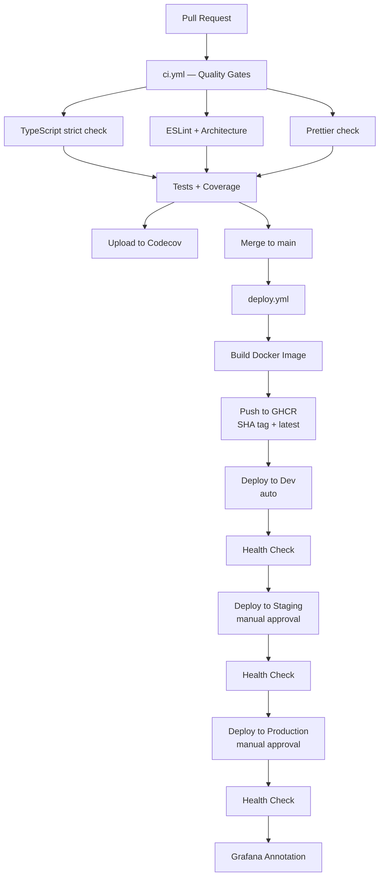

# Deployment Guide

This document covers the CI/CD pipeline, environment configuration, manual deployments, rollback
procedures, SSL certificate management, and GitHub Secrets setup.

## CI/CD Pipeline

The pipeline is split into five workflows:

- **`ci.yml`** — runs on every PR to `main` and on push to `main`. Runs quality gates and tests
- **`deploy.yml`** — runs on push to `main`. Builds a Docker image, pushes to GHCR, and deploys
  the same image through dev → staging → production (artifact promotion)
- **`db-backup.yml`** — daily PostgreSQL backups (03:00 UTC) to Yandex S3 via Dokploy API. Also
  supports manual `backup-now` and `setup-schedules` actions
- **`uptime.yml`** — health checks every 15 minutes for all 3 environments
- **`cleanup.yml`** — weekly GHCR cleanup (Sunday 02:00 UTC), deletes untagged images keeping last
  10 versions

<!-- prettier-ignore -->

```mermaid
%%{init: {theme: 'neutral'}}%%
flowchart TD
    pr[Pull Request] --> ci[ci.yml — Quality Gates]
    ci --> ts[TypeScript strict check]
    ci --> lint[ESLint + Architecture]
    ci --> fmt[Prettier check]
    ts & lint & fmt --> test[Tests + Coverage]
    test --> codecov[Upload to Codecov]
    test --> merge[Merge to main]
    merge --> deploy[deploy.yml]
    deploy --> build[Build Docker Image]
    build --> ghcr[Push to GHCR\nSHA tag + latest]
    ghcr --> dev_env[Deploy to Dev\nauto]
    dev_env --> health_dev[Health Check]
    health_dev --> staging[Deploy to Staging\nmanual approval]
    staging --> health_stg[Health Check]
    health_stg --> prod[Deploy to Production\nmanual approval]
    prod --> health_prod[Health Check]
    health_prod --> grafana[Grafana Annotation]
```

### ci.yml Steps

| Step                    | Tool                   | Failure behavior                         |
| ----------------------- | ---------------------- | ---------------------------------------- |
| TypeScript strict check | `tsc --noEmit`         | Blocks merge                             |
| ESLint                  | `turbo run lint`       | Blocks merge                             |
| Prettier check          | `prettier --check .`   | Blocks merge                             |
| YAML lint               | `yamllint .github/`    | Blocks merge                             |
| Architecture check      | `turbo run check:arch` | Blocks merge                             |
| Tests                   | `turbo run test`       | Blocks merge                             |
| Coverage upload         | `codecov-action@v5`    | Blocks merge (`fail_ci_if_error: true`)  |
| Sentry source maps      | `@sentry/cli`          | Blocks merge (runs after quality + test) |

### deploy.yml Steps

| Step                      | Tool             | Failure behavior  |
| ------------------------- | ---------------- | ----------------- |
| Build Docker image        | `docker build`   | Blocks deploy     |
| Push to GHCR              | `docker push`    | Blocks deploy     |
| Deploy to dev             | Dokploy REST API | Blocks promotion  |
| Health check (dev)        | `curl /health`   | Blocks promotion  |
| Deploy to staging         | Dokploy REST API | Requires approval |
| Health check (staging)    | `curl /health`   | Blocks promotion  |
| Deploy to production      | Dokploy REST API | Requires approval |
| Health check (production) | `curl /health`   | Blocks pipeline   |
| Verify /metrics           | `curl /metrics`  | Non-blocking      |
| Grafana annotation        | Grafana API      | Non-blocking      |

## Environments

| Environment | External Port | Internal Port | URL                                     | Approval |
| ----------- | ------------- | ------------- | --------------------------------------- | -------- |
| Production  | `:3013`       | `:3001`       | `https://apolenkov.duckdns.org`         | Manual   |
| Staging     | `:3012`       | `:3001`       | `https://staging.apolenkov.duckdns.org` | Manual   |
| Dev         | `:3011`       | `:3001`       | `https://dev.apolenkov.duckdns.org`     | Auto     |

All environments deploy from `main` via artifact promotion — the same Docker image (tagged with the
commit SHA) is promoted through dev → staging → production. Each environment maps to a separate
Dokploy service and a separate PostgreSQL container with its own persistent volume.

## Deploy via Git Push

The project uses trunk-based development — all deployments flow from a single `main` branch:

```bash
# 1. Create a feature branch
git checkout -b feat/my-feature main

# 2. Make changes, commit, push
git push origin feat/my-feature

# 3. Open a PR to main — ci.yml runs quality gates
gh pr create --base main

# 4. After merge to main — deploy.yml builds and promotes automatically
#    dev (auto) → staging (manual approval) → production (manual approval)
```

Monitor progress in the GitHub Actions tab. Staging and production deploys require manual approval
via GitHub Environments.

## Manual Deploy via gh CLI

To trigger a deploy without pushing new commits:

```bash
# Re-run the last deploy workflow
gh run list --workflow=deploy.yml --branch=main --limit=1
gh run rerun <run-id>
```

To trigger the Dokploy API directly (bypassing CI):

```bash
curl -sf -X POST \
  "$DOKPLOY_URL/api/trpc/application.deploy" \
  -H "x-api-key: $DOKPLOY_TOKEN" \
  -H "Content-Type: application/json" \
  -d "{\"json\":{\"applicationId\":\"$SERVICE_ID\"}}"
```

## Rollback

### Via Dokploy UI

1. Open the Dokploy admin panel at `http://185.239.48.55:3000`
2. Select the target service (e.g., `myapp-hello-prod`)
3. Navigate to **Deployments** tab
4. Click **Redeploy** on a previous successful deployment

### Via Git Revert

```bash
# Find the last good commit
git log --oneline main

# Revert the bad commit (creates a new revert commit)
git revert <bad-commit-sha>
git push origin main
```

Never force-push to `main`. The revert commit triggers a new pipeline run that deploys the reverted
state.

### Database Migrations

Migrations run automatically on every application startup before the HTTP server
begins accepting traffic. The runner is in `apps/api/src/database/migrate.ts`.

#### Advisory Lock

The migration runner acquires a transaction-scoped PostgreSQL advisory lock
(`pg_advisory_xact_lock(7777777)`) inside a `BEGIN` block. Because the lock is
transaction-scoped, it is released automatically on `COMMIT` or `ROLLBACK` —
there is no risk of lock leaks even if the process crashes.

#### Swarm Multi-Replica Behavior

In Docker Swarm, multiple replicas may start simultaneously. Only one instance
acquires the advisory lock and runs migrations. Other replicas block on the lock
until it is released, then skip already-applied migrations (checked against the
`migrations` table). This makes the startup sequence safe for any replica count.

#### Forward-Only Policy

Migrations are forward-only — there are no rollback SQL files. Each migration
uses idempotent patterns (`CREATE TABLE IF NOT EXISTS`, `DO $$ ... END $$`
blocks) so re-running a migration that was already recorded is safe (it is
simply skipped).

#### Migration File Convention

SQL files live in `apps/api/migrations/` and are sorted alphabetically by
numeric prefix:

```text
apps/api/migrations/
  001_initial.sql
  002_add_constraints.sql
  003_add_users.sql
```

#### Error Handling

If any migration fails, the entire transaction is rolled back and the
application throws, which causes the process to exit with code 1. No partial
migrations are applied — either all pending migrations succeed or none do.

#### Database Rollback

Since migrations are forward-only, reversing a change requires a new migration:

1. Write a new migration file in `apps/api/migrations/` that reverses the
   change (e.g., `004_revert_add_users.sql`)
2. Push to `main` — it will be applied automatically on next deployment

Cross-reference: [`apps/api/src/database/migrate.ts`](../apps/api/src/database/migrate.ts)
for implementation, [Development Guide](development.md) for the migration
sequence diagram.

## SSL Certificate Renewal

TLS certificates are issued by Let's Encrypt via Traefik's built-in ACME HTTP-01 challenge. No
manual renewal is required.

Traefik stores certificates in a volume and renews them automatically 30 days before expiry. To
verify certificate status:

```bash
# Check certificate expiry for the production domain
echo | openssl s_client -connect apolenkov.duckdns.org:443 -servername apolenkov.duckdns.org \
  2>/dev/null | openssl x509 -noout -dates
```

If automatic renewal fails, force renewal by restarting the Traefik service on the VPS:

```bash
docker service update --force traefik_traefik
```

## Observability Stack Deployment

The observability stack consists of 2 lightweight agents (Promtail + Grafana Alloy) deployed on the
VPS, pushing telemetry to Grafana Cloud. No local Grafana, Prometheus, Loki, or Tempo instances run
on the VPS.

### Initial Deploy

```bash
cd infra/ansible
ansible-playbook disaster-recovery/07-observability.yml -i inventory/hosts.yml --ask-vault-pass
```

This copies all configs from `observability/` to `/opt/observability` on the VPS, creates a `.env`
file with Grafana Cloud credentials, and starts the 2 agent services via Docker Compose.

### Full Stack Deploy (Including Observability)

```bash
ansible-playbook disaster-recovery/site.yml -i inventory/hosts.yml --ask-vault-pass
```

### Updating Configs

After modifying any file in `observability/`, redeploy the stack:

```bash
ansible-playbook disaster-recovery/07-observability.yml -i inventory/hosts.yml --ask-vault-pass
```

The playbook uses `synchronize` with `delete: true`, so removed files on the local side will also
be removed on the VPS. Promtail and Alloy will pick up config changes on restart.

### Post-Deploy Verification

The CI/CD pipeline includes two non-blocking post-deploy steps:

1. **Verify /metrics endpoint** — checks that the application exposes Prometheus metrics
2. **Create Grafana deploy annotation** — marks the deploy time on Grafana dashboards for
   correlation with metrics/logs changes

Both steps use `continue-on-error: true` and do not block the pipeline.

## VPS Operations Checklist

Run this quick checklist after each deploy and at least once daily on the VPS.

1. **Service health** — verify `GET /health` returns `200` for prod/staging/dev.
2. **Trace traffic sanity** — hit `GET /v1` a few times per env to generate traces.
3. **Dokploy state** — ensure services are `running` and not restarting/crash-looping.
4. **Host resources** — check disk usage (`df -h`) and Docker usage (`docker system df`).
5. **Housekeeping cron** — confirm `/etc/cron.d/docker-housekeeping` exists and is active.
6. **Backups** — verify latest PostgreSQL backup completed and retention is healthy.
7. **Routing/TLS** — verify domains resolve and TLS cert expiration is within safe window.
8. **Observability** — confirm `/metrics` is reachable and recent traces appear in Grafana.

For full step-by-step ops detail, use `docs/guide.md` (manual checks) and
`infra/ansible/setup-vps-housekeeping.yml` + `infra/ansible/setup-db-backups.yml`.

### Required VPS Environment Variables

| Variable            | Description                                                         |
| ------------------- | ------------------------------------------------------------------- |
| `GRAFANA_API_TOKEN` | Grafana Cloud API key with push permissions for Loki and Prometheus |
| `GRAFANA_ORG_ID`    | Grafana Cloud organization/user ID for Prometheus remote_write auth |
| `LOKI_USER_ID`      | Grafana Cloud Loki user ID for Promtail basic auth                  |

Find `GRAFANA_ORG_ID` and `LOKI_USER_ID` in **Grafana Cloud > My Account > Stack > Details**
(Prometheus and Loki sections respectively).

### Access

| Service       | URL                                 | Access            |
| ------------- | ----------------------------------- | ----------------- |
| Grafana Cloud | `https://<stack>.grafana.net`       | Grafana Cloud SSO |
| Promtail UI   | `http://185.239.48.55:9080/targets` | Internal only     |
| Alloy UI      | `http://185.239.48.55:12345`        | Internal only     |

Dashboards, alerts, and retention are managed in the **Grafana Cloud web interface**. For details on
the observability architecture and adding new services, see the
[Observability Guide](observability.md).

## Fresh VPS Setup

Complete automated setup for a new VPS — from bare metal to fully deployed application.

### Prerequisites

- VPS with Ubuntu 22.04+ and SSH access
- Grafana Cloud account with API token
- Yandex Object Storage bucket for backups
- GitHub repository with CI/CD workflows configured

### Step-by-Step

```bash
cd infra/ansible

# 1. Provision VPS: Docker, Swarm, Dokploy, firewall, housekeeping
ansible-playbook provision-vps.yml -i inventory/hosts.yml --ask-vault-pass

# 2. Create Dokploy project, 3 apps (dev/staging/prod), 3 PostgreSQL services
ansible-playbook setup-dokploy-apps.yml -e @vars/secrets.yml --ask-vault-pass

# 3. Configure environment variables for each Dokploy application
ansible-playbook setup-environments.yml -e @vars/secrets.yml --ask-vault-pass

# 4. Setup DB backup schedules (S3 destination + daily cron)
ansible-playbook setup-db-backups.yml -e @vars/secrets.yml --ask-vault-pass

# 5. Deploy observability agents (Promtail + Alloy → Grafana Cloud)
ansible-playbook disaster-recovery/07-observability.yml -i inventory/hosts.yml --ask-vault-pass

# 6. Provision Grafana dashboards and alert rules
ansible-playbook setup-grafana-dashboards.yml -e @vars/secrets.yml --ask-vault-pass

# 7. Bulk-set all 23 GitHub secrets (interactive or from env file)
cd ../../
./scripts/setup-github-secrets.sh                       # interactive
./scripts/setup-github-secrets.sh --from-env .env.secrets  # from file
./scripts/setup-github-secrets.sh --dry-run              # preview only
```

After step 7, push to `main` to trigger the full CI/CD pipeline (build → dev → staging → prod).

### Ansible Playbook Reference

| Playbook                       | Purpose                                           | Idempotent |
| ------------------------------ | ------------------------------------------------- | ---------- |
| `provision-vps.yml`            | Base VPS setup (Docker, Swarm, Dokploy, firewall) | Yes        |
| `setup-dokploy-apps.yml`       | Create Dokploy project, apps, PostgreSQL services | Yes        |
| `setup-environments.yml`       | Configure app environment variables               | Yes        |
| `setup-db-backups.yml`         | S3 backup destination + backup schedules          | Yes        |
| `setup-grafana-dashboards.yml` | Grafana dashboards + alert rules provisioning     | Yes        |
| `setup-vps-housekeeping.yml`   | Docker cleanup cron, log rotation                 | Yes        |
| `restore-db.yml`               | Restore PostgreSQL from S3 backup                 | —          |

All playbooks use `hosts: localhost` with `connection: local` (API calls from your machine, not SSH
to VPS). Secrets are read from `vars/secrets.yml` (Ansible Vault encrypted).

## GitHub Secrets

The following secrets must be configured in the repository before the pipeline can deploy.

**Bulk setup** — use the interactive script instead of setting secrets one by one:

```bash
./scripts/setup-github-secrets.sh              # interactive prompts
./scripts/setup-github-secrets.sh --from-env .env.secrets  # read from KEY=VALUE file
./scripts/setup-github-secrets.sh --dry-run     # preview what would be set
```

| Secret                         | Description                                                                        |
| ------------------------------ | ---------------------------------------------------------------------------------- |
| `DOKPLOY_URL`                  | Dokploy API base URL (e.g., `http://185.239.48.55:3000`)                           |
| `DOKPLOY_TOKEN`                | Dokploy API key — generate in Dokploy Settings                                     |
| `DOKPLOY_SERVICE_ID_PROD`      | Dokploy application ID for the production service                                  |
| `DOKPLOY_SERVICE_ID_STAGING`   | Dokploy application ID for the staging service                                     |
| `DOKPLOY_SERVICE_ID_DEV`       | Dokploy application ID for the dev service                                         |
| `DOKPLOY_DESTINATION_ID`       | Dokploy S3 backup destination ID (for `db-backup.yml`)                             |
| `APP_PUBLIC_URL`               | Public app URL for post-deploy /metrics check                                      |
| `APP_PUBLIC_URL_DEV`           | Dev environment URL for health check                                               |
| `APP_PUBLIC_URL_STAGING`       | Staging environment URL for health check                                           |
| `SENTRY_DSN`                   | Sentry error tracking DSN (runtime env var on Dokploy)                             |
| `SENTRY_AUTH_TOKEN`            | Sentry auth token for CI source maps upload                                        |
| `CODECOV_TOKEN`                | Codecov upload token — obtain from codecov.io                                      |
| `GRAFANA_URL`                  | Grafana base URL for deploy annotations                                            |
| `GRAFANA_API_TOKEN`            | Grafana API token for deploy annotations                                           |
| `OTEL_EXPORTER_OTLP_ENDPOINT`  | Grafana Cloud OTLP gateway URL                                                     |
| `OTEL_EXPORTER_OTLP_HEADERS`   | OTLP auth header (`Authorization=Basic <base64>`)                                  |
| `GRAFANA_TEMPO_QUERY_URL`      | Tempo query URL (for trace verification), e.g. `https://<stack>.grafana.net/tempo` |
| `GRAFANA_TEMPO_USER`           | Grafana Cloud stack user / instance ID for Tempo basic auth                        |
| `GRAFANA_TEMPO_READ_TOKEN`     | Access Policy token with `traces:read` scope only                                  |
| `GRAFANA_TEMPO_DATASOURCE_UID` | Tempo datasource UID in Grafana                                                    |
| `YANDEX_S3_ACCESS_KEY`         | Yandex Object Storage access key (for Ansible backup setup)                        |
| `YANDEX_S3_SECRET_KEY`         | Yandex Object Storage secret key (for Ansible backup setup)                        |

## See Also

- [Architecture](architecture.md) — Infrastructure diagrams
- [Observability Guide](observability.md) — Monitoring stack, dashboards, alerts
- [Development Guide](development.md) — Local setup and running tests
- [API Reference](api.md) — Endpoint documentation

Security note: keep write and read telemetry tokens separate (`traces:write` for app ingestion,
`traces:read` for diagnostics/verification) to minimize blast radius.
