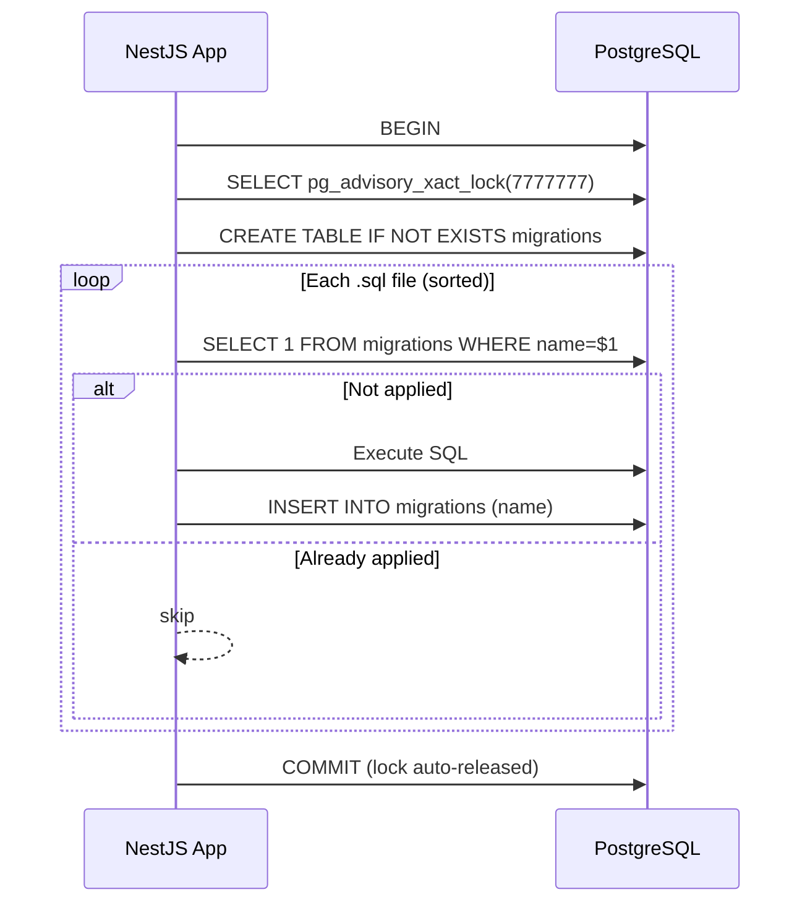

# Development Guide

This document covers local environment setup, available npm scripts, database migration workflow,
and how to run tests.

## Prerequisites

| Requirement    | Minimum version           | Notes                                 |
| -------------- | ------------------------- | ------------------------------------- |
| Node.js        | 22                        | Use `nvm` or `fnm` to manage versions |
| npm            | 10                        | Bundled with Node.js 22               |
| Docker         | 24                        | Required for local PostgreSQL         |
| Docker Compose | v2 (`compose` subcommand) | Bundled with Docker Desktop           |

## Local Setup

```bash
# 1. Clone the repository
git clone https://github.com/apolenkov/myapp-hello.git
cd myapp-hello

# 2. Install dependencies
npm install

# 3. Copy and edit environment variables
cp .env.example .env
# Edit .env — set DATABASE_URL if needed (docker-compose sets it automatically)

# 4. Start with Docker Compose (app + PostgreSQL)
docker compose up --build

# 5. Verify the app is running
curl http://localhost:3001/health
# {"status":"ok"}
```

To run only the app (without Docker), start PostgreSQL separately then:

```bash
npm run dev
```

`npm run dev` uses `nest start --watch` — the server restarts automatically on file changes using SWC
for fast compilation.

## npm Scripts

| Script                  | Command                                          | Description                               |
| ----------------------- | ------------------------------------------------ | ----------------------------------------- |
| `npm start`             | `node dist/main.js`                              | Start compiled production build           |
| `npm run dev`           | `nest start --watch`                             | Start dev server with hot reload (SWC)    |
| `npm run build`         | `nest build`                                     | Compile TypeScript to `dist/` via SWC     |
| `npm test`              | `vitest run`                                     | Run all tests once                        |
| `npm run test:coverage` | `vitest run --coverage`                          | Run tests and generate coverage report    |
| `npm run lint`          | `eslint src`                                     | Lint TypeScript source files              |
| `npm run lint:fix`      | `eslint src --fix`                               | Auto-fix linting issues                   |
| `npm run format`        | `prettier --write .`                             | Format all files in place                 |
| `npm run format:check`  | `prettier --check .`                             | Verify formatting without modifying files |
| `npm run check:arch`    | `depcruise src --config .dependency-cruiser.cjs` | Enforce architectural boundaries          |

## Database Migrations

Migrations run automatically when the application starts (if `DATABASE_URL` is set). The migration
system is idempotent — running it multiple times is safe.

<!-- prettier-ignore -->


### How It Works

1. The app connects to PostgreSQL, opens a transaction, and acquires
   `pg_advisory_xact_lock(7777777)`. This is a transaction-scoped lock — it auto-releases on
   `COMMIT` or `ROLLBACK`, eliminating the risk of lock leaks. In a Docker Swarm environment where
   multiple replicas can start at the same time, only one instance proceeds — the rest block until
   the lock is released.
2. A `migrations` table is created if it does not exist.
3. All `.sql` files in the `migrations/` directory are read and sorted alphabetically. Each file is
   checked against the `migrations` table. Already-applied files are skipped.
4. New files are executed within the same transaction. On success, the filename is recorded and the
   transaction is committed. On failure, the transaction is rolled back and the application exits
   with code 1.

### Adding a Migration

Create a new `.sql` file in `migrations/` using a numeric prefix to control ordering:

```bash
# Example: add a users table
cat > migrations/002_add_users.sql << 'EOF'
CREATE TABLE IF NOT EXISTS users (
  id SERIAL PRIMARY KEY,
  email VARCHAR(255) UNIQUE NOT NULL,
  created_at TIMESTAMPTZ DEFAULT now()
);
EOF
```

The next application startup will apply it automatically.

### Current Migrations

| File              | Description                                            |
| ----------------- | ------------------------------------------------------ |
| `001_initial.sql` | Creates `health_checks` table (id, checked_at, status) |

## Environment Variables

| Variable       | Default                                               | Notes                                |
| -------------- | ----------------------------------------------------- | ------------------------------------ |
| `PORT`         | `3001`                                                | Change if port is occupied           |
| `NODE_ENV`     | `development`                                         | Controls log format and env label    |
| `APP_NAME`     | `myapp-hello`                                         | Appears in API responses             |
| `DATABASE_URL` | See `.env.example` (docker-compose reads from `.env`) | Full connection string               |
| `JWT_SECRET`   | empty string (auth disabled without a secret)         | Required for protected routes        |
| `LOG_LEVEL`    | `info`                                                | Options: trace/debug/info/warn/error |

When running with `docker compose up`, all defaults from `docker-compose.yml` are applied
automatically.

## Running Tests

```bash
# Run all tests
npm test

# Run tests in watch mode (re-runs on file change)
npx vitest

# Run tests with coverage report
npm run test:coverage
# Coverage report written to coverage/
```

Tests use [Vitest](https://vitest.dev/). Test files follow the `*.test.ts` or `*.spec.ts` naming
convention.

Coverage is collected via `@vitest/coverage-v8` (Node.js built-in V8 coverage). The coverage
report is uploaded to Codecov on every CI run.

## Code Quality

The project enforces several quality layers:

- **TypeScript strict mode** — `tsconfig.json` enables all strict checks including
  `strictNullChecks`, `noImplicitAny`, and `noUncheckedIndexedAccess`
- **ESLint** with plugins for sonarjs (code quality), unicorn (modern JS), security (vulnerability
  patterns), import-x (import order), and jsdoc (documentation completeness)
- **Prettier** — consistent formatting enforced via pre-commit hook (`husky` + `lint-staged`)
- **dependency-cruiser** — architectural boundaries enforced via `check:arch`; prevents circular
  dependencies and layer violations
- **semantic-release** — automated versioning and changelog generation based on conventional commit
  messages

## Dependency Update Blockers

Some packages cannot be updated to their absolute latest versions due to peer dependency conflicts.
Check these before running bulk updates:

| Package    | Pinned    | Blocker                                             |
| ---------- | --------- | --------------------------------------------------- |
| `eslint`   | `^9.39.3` | `eslint-plugin-import-x` requires `^8.57 \|\| ^9.0` |
| `@swc/cli` | `^0.7.10` | `@nestjs/cli` requires `^0.7.x`                     |

Additional notes:

- `eslint-plugin-unicorn` 63+ uses a default export — ESLint CJS config must use
  `require('eslint-plugin-unicorn').default`
- `vitest` 4 is ESM-only — add `include: ['src/**/*.test.ts']` to vitest config to prevent
  CJS `dist/` files from being picked up

## See Also

- [Architecture](architecture.md) — C4 diagrams and design decisions
- [Deployment Guide](deployment.md) — CI/CD pipeline and environment configuration
- [API Reference](api.md) — Endpoint documentation
