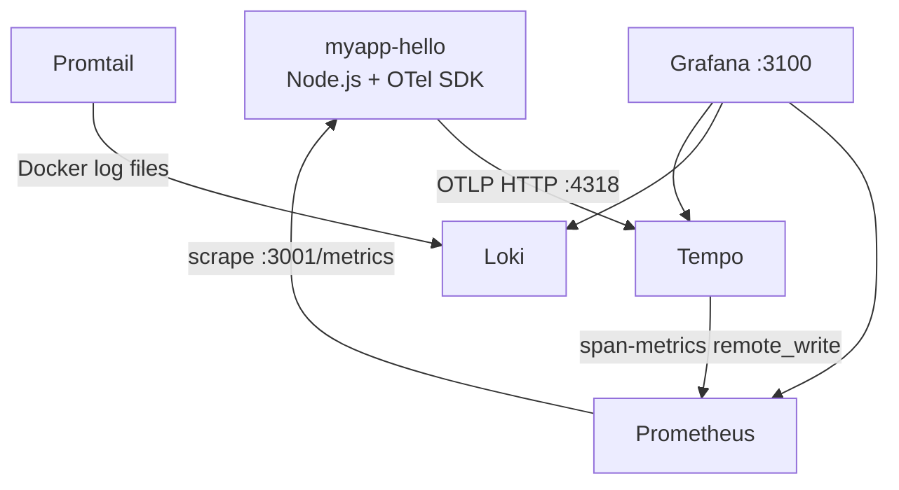

# Observability Guide

This document covers the observability stack for myapp-hello: architecture, access, dashboards,
alerts, adding metrics to new services, retention policies, and troubleshooting.

## Stack Overview

| Component  | Version | Purpose                     | Port (internal) |
| ---------- | ------- | --------------------------- | --------------- |
| Grafana    | 11.5.2  | Dashboards, alerts, explore | 3100 (ext)      |
| Prometheus | v3.2.1  | Metrics storage + scraping  | 9090            |
| Loki       | 3.4.2   | Log aggregation             | 3100            |
| Tempo      | 2.7.1   | Distributed tracing (OTLP)  | 3200 / 4318     |
| Promtail   | 3.4.2   | Docker log collector        | —               |

All services run in Docker Compose on the VPS as a separate stack from the application. Resource
budget: ~0.85 CPU, ~896 MB RAM total.

<!-- prettier-ignore -->


## Three Pillars of Observability

### Metrics (Prometheus + OpenTelemetry)

The application uses OpenTelemetry SDK (`@opentelemetry/sdk-node`) with a Prometheus exporter.
Metrics are exposed at `GET /metrics` in Prometheus text format.

**Custom metrics:**

| Metric                                 | Type      | Labels                                          |
| -------------------------------------- | --------- | ----------------------------------------------- |
| `http_server_request_duration_seconds` | Histogram | `http_method`, `http_route`, `http_status_code` |
| `http_server_request_total_total`      | Counter   | `http_method`, `http_route`, `http_status_code` |

**Auto-instrumentation metrics** (via `@opentelemetry/auto-instrumentations-node`):

- HTTP client/server duration and size
- Express route handler timing
- PostgreSQL query timing

**Default OTel metrics:**

- `target_info` with `service_name` and `service_version` labels

Prometheus scrapes all `myapp*` containers via Docker service discovery, rewriting the port to
`:3001`.

### Logs (Loki + Promtail)

Promtail auto-discovers all Docker containers via `docker_sd_configs` and pushes logs to Loki.

**Pino JSON pipeline:** Promtail parses structured Pino output and extracts:

- `level` (mapped from numeric: 10→trace, 20→debug, 30→info, 40→warn, 50→error, 60→fatal)
- `reqId` (correlation ID)
- `responseTime` (ms)
- `req.method`, `res.statusCode`

**Labels:** `container`, `service`, `image`, `environment`, `stack`

**Noise reduction:** Health check logs (`GET /health`) are dropped to avoid Promtail/Loki noise
from Docker HEALTHCHECK running every 30 seconds.

**Non-JSON logs** (e.g., PostgreSQL) are stored as-is without pipeline parsing.

### Traces (Tempo + OTLP)

The application sends traces to Tempo via OTLP HTTP (port 4318). Tempo generates span-metrics and
writes them to Prometheus via `remote_write`.

**Trace-log correlation:** Loki has a `derivedField` that extracts `traceId` from log lines and
links to Tempo. Clicking a trace ID in Grafana Explore (Loki) opens the corresponding trace in
Tempo.

**Trace-metric correlation:** Tempo is configured with `tracesToMetrics` linking to the Prometheus
datasource.

## Accessing Grafana

| Environment | URL                         | Credentials        |
| ----------- | --------------------------- | ------------------ |
| Production  | `http://185.239.48.55:3100` | From Ansible vault |

Default admin credentials are set via Ansible vault variables `grafana_admin_user` and
`grafana_admin_password`.

## Dashboards

Three pre-built dashboards are auto-provisioned from JSON files:

### App Overview

File: `observability/grafana/dashboards/app-overview.json`

10 panels covering:

- Request rate (req/s)
- Error rate (% of 5xx)
- p95 latency
- Uptime (`up` metric)
- Traffic by route and status code
- Duration percentiles (p50, p95, p99)
- Duration heatmap
- 5xx errors by route
- 4xx errors by route

### Node Runtime

File: `observability/grafana/dashboards/node-runtime.json`

Runtime metrics:

- CPU usage
- Memory RSS
- Heap used vs total
- Event loop lag
- HTTP server duration percentiles
- Active requests

### Logs Overview

File: `observability/grafana/dashboards/logs-overview.json`

Log analytics:

- Log volume by level (stacked bar)
- Log volume by service
- Error log panel (level=error/fatal)
- Slow requests (responseTime > 1000ms)
- Live tail (last 100 log lines)

## Alert Rules

Alerts are configured via Grafana Unified Alerting (no external Alertmanager needed).

### Critical

| Alert         | Condition               | Duration |
| ------------- | ----------------------- | -------- |
| HighErrorRate | >5% of requests are 5xx | 5 min    |
| ServiceDown   | `up == 0`               | 1 min    |

### Warning

| Alert            | Condition                     | Duration |
| ---------------- | ----------------------------- | -------- |
| HighResponseTime | p95 response time > 2s        | 5 min    |
| HighLogErrorRate | >10 error-level logs in 5 min | 5 min    |

Alert rules are defined in `observability/grafana/provisioning/alerting/alerts.yml`.

## Adding Metrics to a New Service

To instrument a new service (e.g., a Python Telegram bot):

### 1. Expose a /metrics endpoint

Use the appropriate Prometheus client library for your language:

- **Node.js:** `@opentelemetry/sdk-node` + `@opentelemetry/exporter-prometheus` (as in myapp-hello)
- **Python:** `prometheus_client` or `opentelemetry-exporter-prometheus`
- **Go:** `prometheus/client_golang`

### 2. Add container labels

Promtail auto-discovers Docker containers. Add labels to your `docker-compose.yml`:

```yaml
services:
  my-bot:
    labels:
      - 'com.docker.compose.service=my-bot'
```

Promtail will pick up logs automatically — no configuration change needed.

### 3. Configure Prometheus scraping

Add a new job to `observability/prometheus/prometheus.yml`:

```yaml
- job_name: my-bot
  docker_sd_configs:
    - host: unix:///var/run/docker.sock
      refresh_interval: 30s
  relabel_configs:
    - source_labels: [__meta_docker_container_name]
      regex: '.*my-bot.*'
      action: keep
    - source_labels: [__meta_docker_port_private]
      regex: '8080' # your metrics port
      action: keep
```

### 4. Add OTLP traces (optional)

Set the `OTEL_EXPORTER_OTLP_ENDPOINT` environment variable:

```yaml
environment:
  OTEL_EXPORTER_OTLP_ENDPOINT: http://tempo:4318
```

### 5. Create a dashboard

Copy an existing dashboard JSON from `observability/grafana/dashboards/` and modify the
queries/panels to match your service metrics.

### 6. Redeploy

```bash
ansible-playbook infra-ansible/playbooks/07-observability.yml \
  -i infra-ansible/inventory/hosts.yml --ask-vault-pass
```

## Retention Policies

| Component  | Retention | Storage limit | Notes                           |
| ---------- | --------- | ------------- | ------------------------------- |
| Prometheus | 30 days   | 1 GB          | `--storage.tsdb.retention.size` |
| Loki       | 30 days   | —             | Compactor auto-deletes          |
| Tempo      | 30 days   | —             | Compactor auto-deletes          |
| Grafana    | Unlimited | —             | Dashboards/config only          |

## Backup

### PostgreSQL Backups

PostgreSQL databases are backed up daily at 03:00 UTC via the `db-backup.yml` GitHub Actions
workflow. Backups are stored in Yandex Object Storage (S3-compatible), with 7-copy retention.
PostgreSQL instances are auto-discovered via the Dokploy `project.all` API — no hardcoded IDs.

Initial setup can be done via Ansible:

```bash
ansible-playbook infra/ansible/setup-db-backups.yml -e @infra/ansible/vars/secrets.yml
```

### Grafana Data

Grafana dashboards and alert rules are provisioned from files in `observability/grafana/` and do not
require backup. Runtime data (annotations, preferences) is stored in the `observability_grafana_data`
Docker volume on the VPS.

## Configuration Files

| File                                                   | Purpose                        |
| ------------------------------------------------------ | ------------------------------ |
| `observability/docker-compose.observability.yml`       | Docker Compose for all 5 svc   |
| `observability/loki/loki-config.yml`                   | Loki single-node config        |
| `observability/promtail/promtail-config.yml`           | Docker SD + Pino JSON pipeline |
| `observability/prometheus/prometheus.yml`              | Scrape targets + retention     |
| `observability/tempo/tempo-config.yml`                 | OTLP receiver + span-metrics   |
| `observability/grafana/provisioning/datasources/*.yml` | Auto-provision datasources     |
| `observability/grafana/provisioning/dashboards/*.yml`  | Dashboard file provider        |
| `observability/grafana/provisioning/alerting/*.yml`    | Unified alerting rules         |
| `observability/grafana/dashboards/*.json`              | 3 pre-built dashboards         |

## Troubleshooting

### Grafana shows "No data"

1. Check that the application container is running: `docker ps | grep myapp`
2. Verify `/metrics` responds: `curl http://localhost:3001/metrics`
3. Check Prometheus targets: open `http://localhost:9090/targets` — myapp should show as `UP`
4. Verify the datasource in Grafana: **Configuration > Data Sources > Prometheus > Test**

### Promtail not collecting logs

1. Check Promtail logs: `docker logs observability-promtail-1`
2. Verify Docker socket access: the compose file mounts `/var/run/docker.sock`
3. Check targets: `curl http://localhost:9080/targets` (Promtail API)

### Traces not appearing in Tempo

1. Verify `OTEL_EXPORTER_OTLP_ENDPOINT` is set in the application environment
2. Check Tempo logs: `docker logs observability-tempo-1`
3. Test OTLP endpoint: `curl http://localhost:4318/v1/traces` (should return method not allowed)
4. Verify Grafana Cloud trace readability with read-only token:

```bash
export GRAFANA_TEMPO_QUERY_URL="https://tempo-prod-10-prod-eu-west-2.grafana.net/tempo"
export GRAFANA_TEMPO_USER="1489367"
export GRAFANA_TEMPO_READ_TOKEN="<glc-traces-read-token>"
scripts/verify-grafana-traces.sh
```

Use separate tokens by purpose:

- ingest path (`OTEL_EXPORTER_OTLP_HEADERS`) → token with `traces:write` (Username: 1489367)
- query path (`scripts/verify-grafana-traces.sh`) → token with `traces:read` (Username: 1489367)

```bash
export GRAFANA_TEMPO_QUERY_URL="https://<stack>.grafana.net/tempo"
export GRAFANA_TEMPO_USER="<stack-instance-id>"
export GRAFANA_TEMPO_READ_TOKEN="<glc-traces-read-token>"
scripts/verify-grafana-traces.sh
```

Use separate tokens by purpose:

- ingest path (`OTEL_EXPORTER_OTLP_HEADERS`) → token with `traces:write`
- query path (`scripts/verify-grafana-traces.sh`) → token with `traces:read`

### Alerts not firing

1. Open Grafana > **Alerting > Alert rules** — check rule status
2. Verify Prometheus queries return data in **Explore > Prometheus**
3. Check Grafana logs: `docker logs observability-grafana-1`

## Security

- `/metrics` endpoint should be blocked from external access via Traefik middleware
- Grafana is protected by admin login (`GF_AUTH_ANONYMOUS_ENABLED=false`)
- Loki, Prometheus, Tempo — no exposed ports, internal network only
- Promtail has read-only access to Docker socket (for container discovery)

## See Also

- [Architecture](architecture.md) — C4 diagrams including observability layer
- [Deployment Guide](deployment.md) — Ansible playbook for deploying the stack
- [API Reference](api.md) — GET /metrics endpoint documentation
