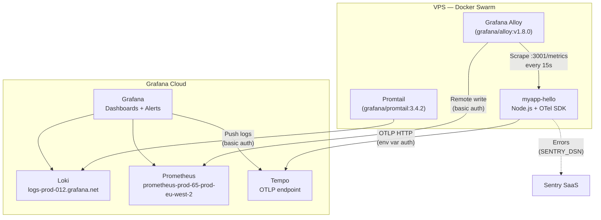

# Observability Guide

Push-based observability stack: lightweight agents on the VPS send telemetry to Grafana Cloud. No
local storage, no local Grafana instance.

## Architecture Overview

| Signal  | Collector                     | Destination                | Auth              |
| ------- | ----------------------------- | -------------------------- | ----------------- |
| Logs    | Promtail (grafana/promtail)   | Grafana Cloud Loki         | Basic auth        |
| Metrics | Grafana Alloy (grafana/alloy) | Grafana Cloud Prometheus   | Basic auth        |
| Traces  | OTel SDK (in-app)             | Grafana Cloud Tempo (OTLP) | Bearer / env vars |
| Errors  | Sentry SDK (in-app)           | Sentry SaaS                | DSN env var       |

Only **2 containers** run on the VPS: Promtail + Alloy. Resource budget: ~0.3 CPU, ~384 MB RAM.

<!-- prettier-ignore -->


## Three Pillars

### Logs (Promtail to Grafana Cloud Loki)

**Collector:** Promtail (`grafana/promtail:3.4.2`) running as a Docker service on the VPS.

**How it works:**

1. Auto-discovers all Docker containers via `/var/run/docker.sock`
2. Parses Pino JSON structured logs (NestJS output)
3. Extracts fields: `level`, `msg`, `req.id`, `req.method`, `req.url`, `res.statusCode`,
   `responseTime`
4. Maps Pino numeric levels to names (10=trace, 20=debug, 30=info, 40=warn, 50=error, 60=fatal)
5. Drops health check noise (`GET /health` every 30s from Docker HEALTHCHECK)
6. Pushes to Grafana Cloud Loki at `https://logs-prod-012.grafana.net/loki/api/v1/push`

**Labels applied:** `container`, `service`, `stack`, `image`, `environment`, `level`, `req_method`,
`res_status`

**Service name normalization:** Strips Dokploy/Swarm random suffixes
(`myapp-hello-prod-qps6m7` becomes `myapp-hello-prod`) for consistent label values.

**Non-JSON logs** (e.g., PostgreSQL) are stored as-is without pipeline parsing.

**Config:** `observability/promtail/promtail-config.yml`

### Metrics (Grafana Alloy to Grafana Cloud Prometheus)

**Collector:** Grafana Alloy (`grafana/alloy:v1.8.0`) running as a Docker service on the VPS.

**How it works:**

1. Docker service discovery (`discovery.docker`) filters containers whose name contains
   "myapp" (via `filter { name = "name"; values = ["myapp"] }`)
2. Relabeling extracts container name, service name (Swarm/Compose), environment
3. Strips Swarm random suffixes for consistent labeling
4. Rewrites target port to `:3001` (app metrics port)
5. Scrapes `/metrics` endpoint every 15s
6. Pushes metrics via `remote_write` to Grafana Cloud Prometheus at
   `https://prometheus-prod-65-prod-eu-west-2.grafana.net/api/prom/push`

**App-side metrics** are exposed via OTel `PrometheusExporter` at `GET /metrics` in Prometheus text
format.

**Custom metrics:**

| Metric                                 | Type      | Labels                                          |
| -------------------------------------- | --------- | ----------------------------------------------- |
| `http_server_request_duration_seconds` | Histogram | `http_method`, `http_route`, `http_status_code` |
| `http_server_request_total_total`      | Counter   | `http_method`, `http_route`, `http_status_code` |

**Auto-instrumentation metrics** (via OTel auto-instrumentations):

- HTTP client/server duration and size
- Express route handler timing
- PostgreSQL query timing
- `target_info` with `service_name` and `service_version` labels

**Config:** `observability/alloy/config.alloy`

### Traces (OTel SDK to Grafana Cloud Tempo)

**Collector:** Built into the application via `instrumentation.ts` (loaded with `--require` before
the app starts).

**How it works:**

1. OTel `NodeSDK` initializes with `OTLPTraceExporter` configured via environment variables
2. Auto-instruments: Express, PostgreSQL (`pg`), HTTP client/server
3. Sends traces directly to Grafana Cloud Tempo via OTLP HTTP
4. No local trace collector needed

**Configuration via environment variables:**

| Variable                      | Purpose                                         |
| ----------------------------- | ----------------------------------------------- |
| `OTEL_EXPORTER_OTLP_ENDPOINT` | Grafana Cloud OTLP gateway URL                  |
| `OTEL_EXPORTER_OTLP_HEADERS`  | `Authorization=Basic <base64(id:token)>`        |
| `OTEL_SERVICE_NAME`           | Service name in traces (default: `myapp-hello`) |

**Trace suppression:** Health check paths (`/health`, `/metrics`) are excluded via
`ignoreIncomingRequestHook` to reduce noise.

**No-op without endpoint:** If `OTEL_EXPORTER_OTLP_ENDPOINT` is not set, the trace exporter is
disabled and only metrics are exported.

## Errors (Sentry)

**SDK:** `@sentry/nestjs` with `SentrySpanProcessor` integrated into OTel pipeline.

**Behavior:**

- No-op without `SENTRY_DSN` environment variable (safe for local development)
- Traces sample rate: 10% in production, 100% in development
- Source maps uploaded in CI via `@sentry/cli` for readable stack traces

**Config:** Initialized in `instrumentation.ts` before OTel SDK starts.

### Recommended Alert Setup

Sentry free plan supports **issue alerts** only (not metric alerts).
Metric alerts (error rate thresholds, latency percentiles) require a paid plan.

Recommended alerts to configure:

| Alert             | Condition                  | Purpose                         |
| ----------------- | -------------------------- | ------------------------------- |
| New Error in Prod | `FirstSeenEventCondition`  | First occurrence of a new error |
| Regression        | `RegressionEventCondition` | Resolved error reappears        |

Configure via Sentry UI (**Settings > Alerts**) or the API. Example -- create a
"New Error in Production" alert via API:

<!-- prettier-ignore -->
```bash
curl -X POST "https://sentry.io/api/0/projects/{org}/{project}/rules/" \
  -H "Authorization: Bearer $SENTRY_AUTH_TOKEN" \
  -H "Content-Type: application/json" \
  -d '{
    "name": "New Error in Production",
    "conditions": [{"id": "sentry.rules.conditions.first_seen_event.FirstSeenEventCondition"}],
    "filters": [{"id": "sentry.rules.filters.tagged_event.TaggedEventFilter",
                 "key": "environment", "match": "eq", "value": "production"}],
    "actions": [{"id": "sentry.mail.actions.NotifyEmailAction",
                 "targetType": "IssueOwners"}],
    "actionMatch": "all", "filterMatch": "all", "frequency": 60
  }'
```

## Local Development

Locally, the observability stack is **not running** (no Promtail/Alloy in `infra/docker-compose.yml`).
This is intentional — local development relies on:

| Signal  | Local access                                |
| ------- | ------------------------------------------- |
| Logs    | `docker compose logs -f app` (Pino JSON)    |
| Metrics | `curl http://localhost:3001/metrics`        |
| Traces  | Disabled (no `OTEL_EXPORTER_OTLP_ENDPOINT`) |
| Errors  | Disabled (no `SENTRY_DSN`)                  |

To test metrics locally:

```bash
curl -s http://localhost:3001/metrics | head -20
```

## Deployment

### Initial Setup

1. Set `GRAFANA_API_TOKEN` environment variable on the VPS (Grafana Cloud API key with push
   permissions for Loki and Prometheus)

2. Deploy the observability stack:

```bash
cd observability
GRAFANA_API_TOKEN=<token> docker compose -f docker-compose.observability.yml up -d
```

1. Set application environment variables in Dokploy for trace export:
   - `OTEL_EXPORTER_OTLP_ENDPOINT` (Grafana Cloud OTLP gateway)
   - `OTEL_EXPORTER_OTLP_HEADERS` (authentication header)
   - `SENTRY_DSN` (optional, for error tracking)

### Adding a New Service

To instrument a new service for metrics collection:

1. **Expose `/metrics`** on port 3001 (or configure Alloy to use a different port)
2. **Name your container with "myapp" in the name** — Alloy auto-discovers containers
   matching this pattern (no Docker labels required)
3. **Logs are automatic** — Promtail discovers all Docker containers, no config change needed
4. **Traces (optional)** — set `OTEL_EXPORTER_OTLP_ENDPOINT` and `OTEL_EXPORTER_OTLP_HEADERS`
   environment variables

### Configuration Files

| File                                             | Purpose                        |
| ------------------------------------------------ | ------------------------------ |
| `observability/docker-compose.observability.yml` | Docker Compose for 2 agents    |
| `observability/promtail/promtail-config.yml`     | Docker SD + Pino JSON pipeline |
| `observability/alloy/config.alloy`               | Alloy scrape + remote_write    |

### Dashboards, Alerts, and Retention

All managed in **Grafana Cloud UI** — no local provisioning files. Changes to dashboards and alert
rules are made directly in the Grafana Cloud web interface.

## Troubleshooting

### Metrics not appearing in Grafana Cloud

1. Check Alloy is running: `docker ps | grep alloy`
2. Verify the container name contains "myapp": `docker ps --format '{{.Names}}' | grep myapp`
3. Verify `/metrics` responds: `curl http://localhost:3001/metrics`
4. Check Alloy logs: `docker logs observability-alloy-1`
5. Check Alloy UI targets: `http://<vps>:12345` (Alloy built-in UI)

### Logs not appearing in Grafana Cloud

1. Check Promtail is running: `docker ps | grep promtail`
2. Check Promtail targets: `curl http://localhost:9080/targets`
3. Check Promtail logs: `docker logs observability-promtail-1`
4. Verify Docker socket access: compose file mounts `/var/run/docker.sock`

### Traces not appearing in Grafana Cloud

1. Verify `OTEL_EXPORTER_OTLP_ENDPOINT` is set in the application environment (Dokploy env vars)
2. Verify `OTEL_EXPORTER_OTLP_HEADERS` contains valid auth (check Grafana Cloud access policy)
3. Check application logs for `Failed to initialize OTel trace exporter` warnings
4. Test connectivity from VPS to Grafana Cloud OTLP endpoint

### Common issues

| Symptom                        | Likely cause                                             |
| ------------------------------ | -------------------------------------------------------- |
| Alloy scrape targets empty     | Container name doesn't contain "myapp" (check naming)    |
| Promtail no targets            | Docker socket not mounted or permissions issue           |
| Traces missing                 | `OTEL_EXPORTER_OTLP_ENDPOINT` not set or auth invalid    |
| Metrics port mismatch          | Alloy hardcodes port 3001, app must expose metrics there |
| Swarm service name with suffix | Relabel rules strip known patterns, check regex          |

## Security

- `/metrics` endpoint is blocked from external access via Traefik middleware
- Promtail has read-only access to Docker socket (container discovery)
- Alloy has read-only Docker socket access (service discovery) + network access to app containers
- All Grafana Cloud communication uses HTTPS with authentication (basic auth or Bearer token)
- `GRAFANA_API_TOKEN` is stored as an environment variable on the VPS, never committed

## See Also

- [Architecture](architecture.md) -- C4 diagrams including observability layer
- [Deployment Guide](deployment.md) -- CI/CD pipeline and environment configuration
- [API Reference](api.md) -- GET /metrics endpoint documentation
